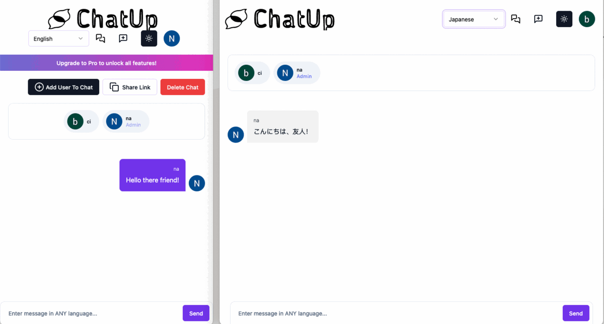

# Messeging Application with the Ability to Translate FROM and TO any language

This is a powerful Saas translator messaging app merging the gap between people of different backgrounds to communicate and receive the messages back in their chosen language. Firestore Translate Text extension does the heavy work in the background of immediately translating the text in the user's desired language as selected in the drop down. Among technologies used are Typescript, Next.js, Firebase Auth, Firestore, NextAuth, Stripe payments, Stripe Portal Link (cancel/edit/update payments), Stripe Hooks, ShadCS (for UI and TW CSS), Zod (for validating forms), Zustand, Vercel (for deployment), and other.

Screenshot of application:

Live link, [here](https://chatgptmessenger-dtemgucuv-nard1n.vercel.app)

## Table of Contents

- [Installation](#Installation)
- [Usage](#Usage)
- [Contributing](#Contributing)
- [Tests](#Tests)
- [License](#License)
- [Questions](#Questions)

## Installation

Feel free to clone the repo or reference the code and simply run it in your browser.

## Usage

Great for practicing various web technologies listed in the overview.

## Contributing

If you would like to add anything, please reach out.

## Tests

n/a

## License

This project is released under MIT opensource license:
https://opensource.org/licenses/MIT

## Questions

For more about my work, check out my Github profile: https://github.com/nard1n
